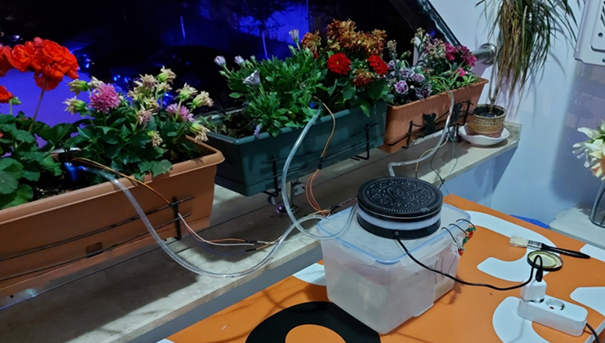
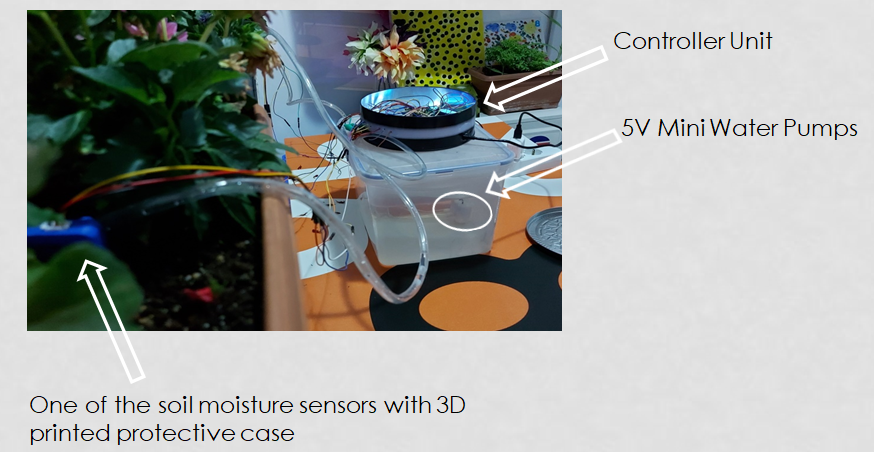
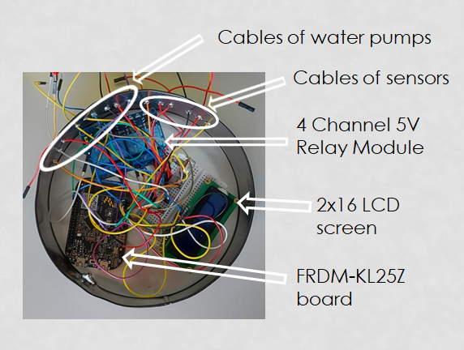

# Plant Watering System 🌱💧

An automatic plant watering system using mbed on the KL25Z board.  
Reads soil moisture, displays status on an LCD, and waters when needed.

## Components
- NXP FRDM-KL25Z
- 3x Soil Moisture Sensors
- 3x Water Pumps (PWM controlled)
- 16x2 LCD with I2C or parallel pins

## Libraries Used
- mbed.h
- TextLCD.h

## Setup
Upload `main.cpp` to your Mbed project using Mbed Studio or the Online IDE.

---

## 🛠️ System Overview

> The system reads moisture levels and automatically waters each plant as needed.

---

## 💡 Controller Unit & Wiring

> All components are housed in a plastic box with mini water pumps, sensors, and relay control.

---

## 🔍 Internal Components

> Includes the KL25Z board, 4-channel relay, sensor and pump connections, and LCD.